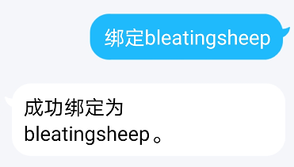
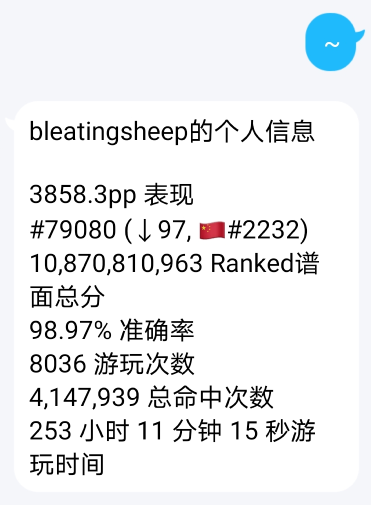
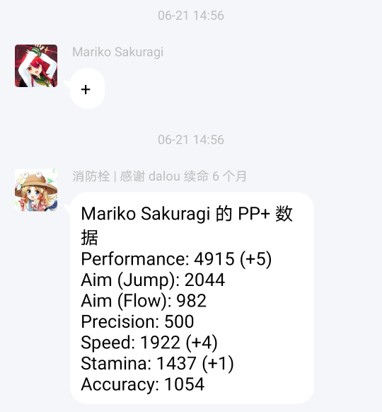
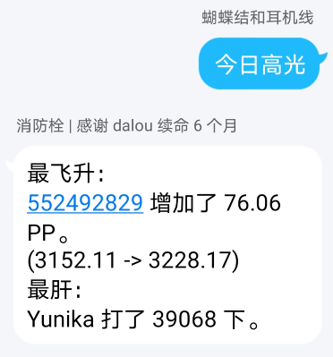
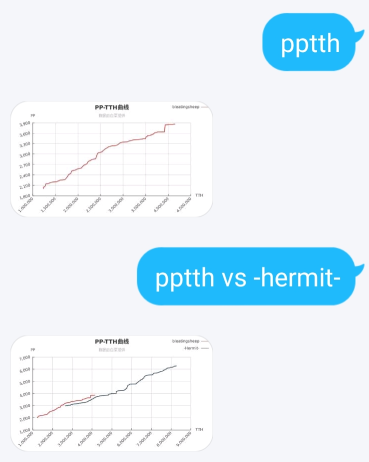
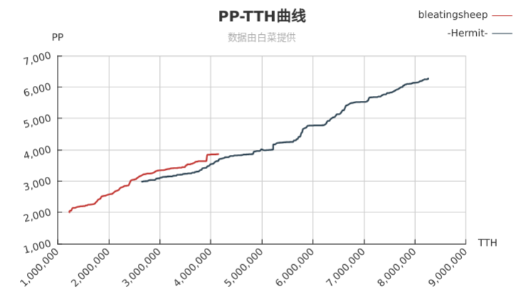

# Xiaofangshuan
## Introduction
Xiaofangshuan is a popular chatting bot in QQ, the most popular IM software in China. It facilitates users (who are also [osu!](https://osu.ppy.sh/) players) to query game data and display to others during chats (mainly group chat). It is a server-side application.

## What can it do?
### Connect your QQ account with osu! account.


### Print your profile


You can send a message like `~`, and then the bot will give a response which is your osu! profile. The response is exactly what you can see at osu! website like [this](https://osu.ppy.sh/users/6659067).

Using the bot is much better than querying the website because not only it's convenient to share your profile in a group chat but also you can see the data changes. You can see how many times did you play today and how many PP (which measures your level) did you gain. The website does not contain the changes because it is saved in my own **database**.

### Print your PP+ profile


This data is from an unofficial website ([PP+](https://syrin.me/pp+/u/6659067/)). It has a different PP algorithm, which is believed to be more precise by a part of players.

This data is not fetched from any kind of API. I write a **web spider** to get HTML and parse data using **regular expressions**.

### Highlight of the day


Gives a response that tells you who gains most PP and who hits most times in the group chat today.

To give response faster, an elaborated **SQL** statement is executed, and the current data is queried in **parallel**.

### PP-TTH




Draws a curve that the x-axis is your total hits and the y-axis is your PP.

Also, you can compare your own curve with other players' as well.

The graph is generated by echarts, a popular charting and visualization library.

### Other functions
It provides various kinds of functions that bring delight to group chats. I started developing it since 2017, so there are too many functions to list. Each new function entails new knowledge and I've learned how to solve practical problems in development.

## Folders (Projects)
**This section is WIP.**

|Folder|Description|
|-|-|
|Bleatingsheep.NewHydrant|The framework.|
|Bleatingsheep.NewHydrant.Bot|Service code.|
|Bleatingsheep.NewHydrant.Data|Data access and update.|
|Bleatingsheep.NewHydrant.Irc|IRC bot.|
|Bleatingsheep.OsuApiClient|API Client.|
|Bleatingsheep.OsuQqBot.Database|Models and database context.|
|OsuQqBot|Legacy code.|
|OsuQqBotHttp|Legacy code.|
|Tests.Database|Legacy code.|
|UnitTests|Legacy test code.|

### Bleatingsheep.NewHydrant
`Bleatingsheep.NewHydrant` is the framework project.

### Bleatingsheep.NewHydrant.Bot
Service code or business code. 

### Bleatingsheep.NewHydrant.Data
It is basically a wrap of the database. Also, it fetches data from other data sources like my friend's API. If more than one sources of the same data are available, it chooses the best one. It also contains some retry policies.

### OsuQqBot, OsuQqBotHttp
Legacy code. They still function. They run as expected but it is not convenient to add services there because of the naïve design.

### UnitTests
It was used to test this application, but it's not used now.

I've got basic comprehension about unit tests. However, I have yet to find a way to use unit tests in Xiaofangshuan elegantly and bring me convenience.

I add some tests to keep me from making same mistakes, occasionally.

## Platforms, Techs and Tools
- .NET Core (as well as ASP .NET Core, EF Core, etc.)
- Linux
- Docker
- HTTP

This application is made to run on .NET Core. It used to run on Windows Server, but now it run on Linux because Linux is provided by most VPS sellers.

CoolQ and this application run in separate Docker containers.

There is an ASP .NET Core application that provides API about Xiaofangshuan, but it's not in this repository.

<!-- ### Headless Chrome
Sometimes I want to send an image as response. To simplify the drawing, I use headless Chrome to take screenshots so that I can just write HTML.  -->

<!-- ## Highlights
I think the most significant highlight is the design of framework. To make development convenient, I introduced an attribute class `ComponentAttribute` and several interfaces. The `ComponentAttribute` indicates that classes marked with this attribute should be processed by the framework. It is analogous to `ControllerAttribute` in ASP .NET Core. The implemented interfaces tell the framework about how to deal with the class. For example:
```C#
[Component("pixiv")]
public class Pixiv : IMessageCommand
{
    public async Task ProcessAsync(MessageContext context, HttpApiClient api)
    {
        string url = "https://rsshub.app/pixiv/ranking/day";
        ... 
    }

    public bool ShouldResponse(MessageContext context)
        => context.Content.TryGetPlainText(out string text) && text.Trim() == "ピクシブ";
}
```
This component sends a popular image from Pixiv at random.

The `ShouldResponse` method returns a `bool` value that indicates whether a specific message is a command to this component. If so, the framework will invoke the `ProcessAsync` method. -->
<!-- (Design of framework.) -->
<!-- Understand DI use->understand -->

<!-- ## Related works
I did these works.

### PP+ Spider
A spider that gets data from [PP+](https://syrin.me/pp+/). This website is made by others. I use regex to get dimensions of user performance from pages like [this](https://syrin.me/pp+/u/bleatingsheep/).

### osu! API Client (two versions) -->

<!-- ## About what I've learnt during making Xiaofangshuan
I learn on my own demand. For example, at the very beginning I make Xiaofangshuan, the data was stored in files.  -->
<!-- DB -->
<!-- DI -->
<!-- Tests -->